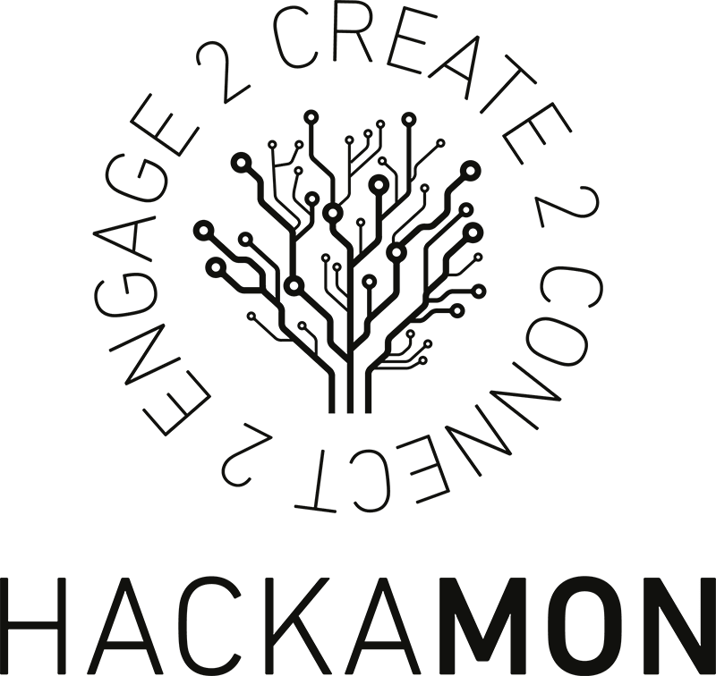

# Hackathon repositories
A collection of repositories relating to all publically available hackathon competition code that I have contributed to.
## Some of the hackathons
### [Unearthed Melbourne 2017](https://www.unearthed.solutions/hackathons/unearthed-melbourne-2017/)

### [Spotless hack @ the 'G 2016](https://spotless-hack-the-g.devpost.com/)

### [Monash University Hackamon 2016](http://www.monash.edu/students/hackamon/hackamon2016)
### [Monash University Hackamon 2017](http://www.monash.edu/students/hackamon)

### [The IDEATOR](https://www.eventbrite.com.au/e/the-ideator-tickets-24798744713#)

