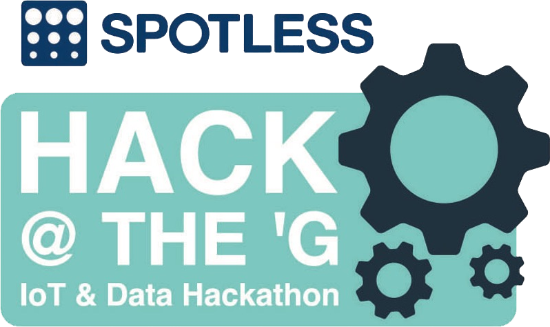

# Hackathon repositories
A collection of repositories relating to all publicly available hackathon competition code that I have contributed to.

## Some of the hackathons:

### [Unearthed Melbourne 2017](https://portal.unearthed.solutions/competitions/unearthed-melbourne-2016) Team: Monash

### [Spotless hack @ the 'G 2016](https://spotless-hack-the-g.devpost.com/submissions) Team: Intellibins

### [Monash University Hackamon 2016](http://www.monash.edu/students/hackamon/hackamon2016) Team: Pineapples Under the Sea
### [Monash University Hackamon 2017](http://www.monash.edu/students/hackamon) Team: Pineapple Bae

### [The IDEATOR](https://www.eventbrite.com.au/e/the-ideator-tickets-24798744713#) Team: VRA

